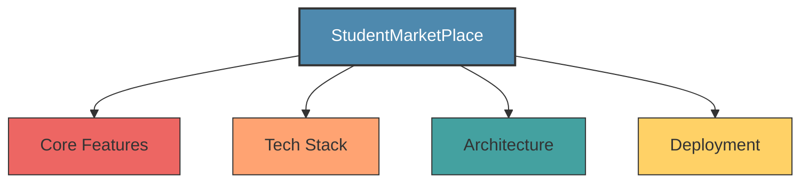
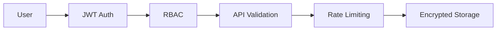
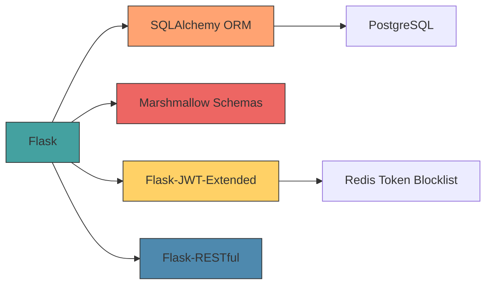
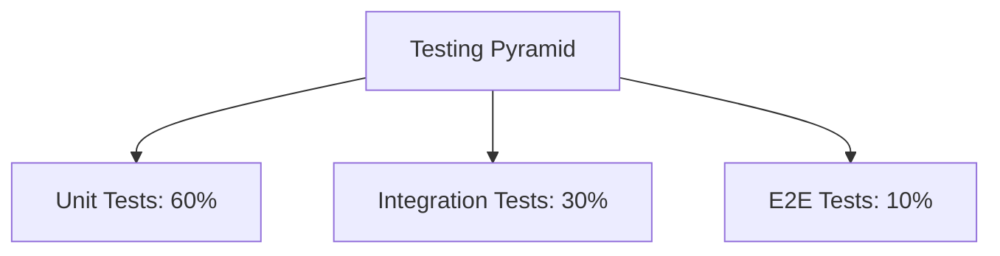
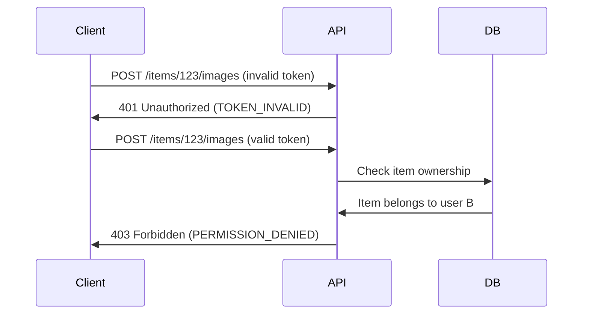
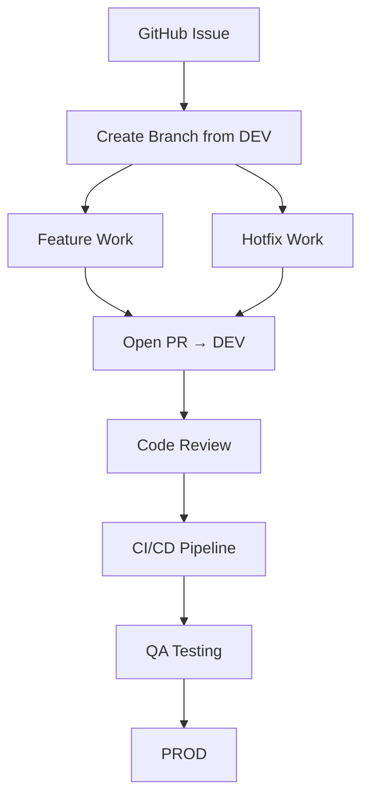

# 🎓 StudentMarketPlace: Campus Buy & Sell Platform
## 🌐 API Access

The API is live and accessible here:

👉 [`marketplace-api-bjdwhhdbgnauhgac.canadacentral-01.azurewebsites.net`](marketplace-api-bjdwhhdbgnauhgac.canadacentral-01.azurewebsites.net)

PLEASE NOTE:
> 
> ⚠️ This is a pre-release version (`v0.1.0-beta`)
> 
> ⚠️ URL may change in future production deployments



## 🌟 Project Overview

**StudentMarketPlace** is a university-focused marketplace platform that enables students to buy, sell, and trade items
within their campus community. Built with modern security practices and a scalable architecture, this platform helps
students save money while promoting sustainability through reuse of textbooks, electronics, furniture, and other campus
essentials.

<div align="center">
  
  
  
  
  
</div>

## ✨ Key Features

### 🛍️ Marketplace Essentials
## 🧠 System Call Graph

This diagram gives a quick overview of how different parts of the system interact:


---

- **📋 Smart Listings** - Create listings with rich descriptions, multiple images, and category tagging
- **🔍 Intelligent Search** - Filter by price range, condition, category, and campus proximity
- **📬 In-App Messaging** - Secure communication between buyers and sellers
- **📊 Analytics Dashboard** - Real-time insights for administrators
- **🔐 Auth System** - JWT-based authentication with password recovery

### 🛡️ Security Framework



- Role-Based Access Control (RBAC)
- JWT token revocation system
- Input validation for all API endpoints
- Rate limiting and brute-force protection
- Secure password storage with bcrypt

---

## 🧩 Technology Stack

### 🏗️ Backend Architecture



**Core Components:**

- **Python 3.11+** - Primary backend language
- **Flask** - Lightweight web framework
- **SQLAlchemy** - Database ORM and migration management
- **PostgreSQL** - Primary relational database
- **Redis** - Token revocation store and caching
- **Docker** - Containerization for consistent environments

### 📦 Project Structure

```bash
📦 API-Core/
├── 📁 app/
│   ├── 📁 blueprints/          # 📦 Modular route groups
│   │   ├── 📁 auth/            # 🔐 Auth routes
│   │   ├── 📁 items/           # 🛒 Item listing routes
│   │   └── 📁 messages/        # 💬 Messaging routes
│   ├── 📁 schemas/             # 📜 Marshmallow schemas (validation)
│   ├── 📁 services/            # 🧠 Business logic layer
│   ├── 📁 models/              # 🗄️ SQLAlchemy models
│   ├── 📄 extensions.py        # 🔌 Init db, jwt, cors
│   └── 📄 __init__.py          # 🛠️ create_app() factory
├── 📁 infra/
│   ├── 📄 docker-compose.yml   # 🐳 Docker services config
│   └── 📄 nginx.conf           # 🌐 Reverse proxy config
├── 📁 postman/
│   └── 📄 MarketplaceAPI.postman_collection.json  # 📬 API collection for testing
├── 📄 run.py                   # 🚀 App runner
└── 📄 requirements.txt         # 📦 Python dependencies
```

---

## 🚀 Getting Started

### Prerequisites

```bash
📦 Required Tools
├── 🐍 Python 3.11+
├── 🐘 PostgreSQL 14+
├── 🧠 Redis 6+
├── 🐳 Docker 20.10+
└── 📦 Node.js 18+ (for frontend)
```

### Installation

```bash
# Clone the repository
git clone https://github.com/Flow-Pie/StudentMarketPlace.git
cd StudentMarketPlace

# Set up backend environment
python -m venv .venv
source .venv/bin/activate
pip install -r requirements.txt

# Configure environment
cp .env.example .env
```

### Configuration

Create `.env` file with:

```env
# 🌐 Application Settings
APP_ENV=development
DEBUG=True

# 🗄️ Database Configuration
DB_HOST=localhost
DB_PORT=5432
DB_NAME=marketplace
DB_USER=marketplace_user
DB_PASSWORD=secure_password

# 🔐 JWT Configuration
JWT_SECRET_KEY=your_secure_secret_here
JWT_ACCESS_TOKEN_EXPIRES=3600  # 1 hour
JWT_REFRESH_TOKEN_EXPIRES=2592000  # 30 days

# 🧠 Redis Configuration
REDIS_URL=redis://localhost:6379/0
```

### Running the Application

```bash
# Initialize database
flask db upgrade

# Start backend server
flask run --host=0.0.0.0 --port=5000

# Start Redis service
docker run -d -p 6379:6379 redis:alpine
```

---

## 🧪 Testing & Quality

### 🧪 Testing Strategy



### Test Execution

```bash
# Run Python tests with coverage
pytest --cov=app --cov-report=html

# Run security scans
bandit -r app
safety check

# Generate code quality report
flake8 app
```

### Quality Tools

```bash
🔍 Code Linters
├── Flake8 (Python)
├── ESLint (JavaScript)
└── MarkdownLint (Documentation)

🎨 Code Formatters
├── Black (Python)
└── Prettier (Frontend)

🛡️ Security Scanners
├── Bandit
└── Safety
```

---

## 🌐 API Documentation

Explore our interactive API documentation at `http://localhost:5000/` after starting the server.

### Sample Endpoints

```http
POST /api/auth/login
Content-Type: application/json

{
  "email": "student@university.edu",
  "password": "securePassword123!"
}
```

```http
GET /api/items?category=BOOKS&min_price=10&max_price=50
Authorization: Bearer <access_token>
```

### Error Handling


---

## 🚢 Deployment

### Docker Setup

```dockerfile
# docker-compose.yml
version: '3.8'

services:
  web:
    build: .
    command: flask run --host=0.0.0.0 --port=5000
    volumes:
      - .:/app
    ports:
      - "5000:5000"
    environment:
      - DB_HOST=db
      - REDIS_URL=redis://redis:6379/0
    depends_on:
      - db
      - redis

  db:
    image: postgres:14
    environment:
      POSTGRES_DB: marketplace
      POSTGRES_USER: marketplace_user
      POSTGRES_PASSWORD: db_password
    volumes:
      - postgres_data:/var/lib/postgresql/data

  redis:
    image: redis:6

volumes:
  postgres_data:
```

### Cloud Deployment

```bash
# Deploy to Heroku
heroku create
heroku addons:create heroku-postgresql:hobby-dev
heroku addons:create heroku-redis:hobby-dev
git push heroku main

# Deploy to AWS ECS
ecs-cli configure --cluster marketplace-cluster
ecs-cli compose --project-name marketplace service up
```

---

## 🤝 Contributing

```markdown
# 🚀 Contributing Guide

*Crafting Excellence in Our Second-Hand Marketplace API*

+ 🌟 First time contributor? Start with "Good First Issue" tasks!

- ‼️ Never push to main/dev directly 
```



### Branch Strategy

| Label Type   | Branch Format           | Example                      |
|--------------|-------------------------|------------------------------|
| `Feature`    | `feature/[LABEL]-desc`  | `feature/auction-bid-system` |
| `Bug`        | `hotfix/[LABEL]-issue`  | `hotfix/user-auth-401`       |
| `Experiment` | `spike/[LABEL]-poc`     | `spike/redis-caching`        |
| `Refactor`   | `refactor/[LABEL]-area` | `refactor/item-search`       |

### Commit Guidelines

```bash
git commit -m "feat(notifications): ✨ add push notification service" -m "
- Integrated Firebase Cloud Messaging
- Added rate limiting
- Created documentation in /docs/notifications.md
"
```

| Emoji | Type     | Description                |
|-------|----------|----------------------------|
| ✨     | feat     | New feature                |
| 🐛    | fix      | Bug fix                    |
| 📚    | docs     | Documentation improvements |
| 🚀    | perf     | Performance optimization   |
| 🔒    | security | Security-related changes   |

---

## 📜 License

This project is licensed under the Apache License - see the [LICENSE](LICENSE) file for details.

## 🆘 Support

📬 Contact Options
├── ✉️ Email: startabase@gmail.com
├── 💬 Slack: #student-marketplace-support
└── 🐞 GitHub Issues:  [GitHub Issues](https://github.com/Flow-Pie/StudentMarketPlace/issues)

```bash
📬 Contact Options
├── ✉️ Email: startabase@gmail.com
├── 💬 Slack: #student-marketplace-support
└── 🐞 GitHub Issues
```

<div align="center">
  <br>
  
  
  
  <br><br>
  <h3>👨‍💻 Happy Trading!</h3>
  <p>The StudentMarketPlace Team</p>
</div>
